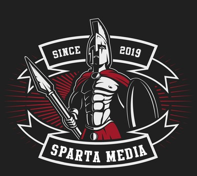

---

layout: col-sidebar
title: OWASP Meerut
tags: meerut
region: Asia

---

## Welcome
Welcome to the Meerut chapter homepage. The chapter board is [Hanut Kumar Arora](mailto:hanut.arora@owasp.org), [Vivek Kumar](mailto:vivek.kumar@owasp.org) and [Teena Garg](mailto:teena.garg@owasp.org).  
Follow chapter news on [Meetup](https://www.meetup.com/OWASP-Meerut-Chapter/) | [Facebook](https://www.facebook.com/OWASPMeerut) | [YouTube](https://www.youtube.com/channel/UC1PIyiJ4-X0OrOXiy0A1Y0g/) | [LinkedIn](https://www.linkedin.com/groups/10441368/) | [Instagram](https://www.instagram.com/OWASPMeerut) | [Slack](https://owasp.slack.com/messages/CJNJRF327)

## Chapter Supporters
<table cellpadding="15" cellspacing="0">
    <tr>
        <td></td>
    </tr>
</table>

## Participate
There are 2 ways to participate in the OWASP Meerut Chapter Events
* **Attending the Event**
* **Speaking at the Event**  
Look at the **Participation** Tab for further details.

## Meetings / Events
Meetings / Events information is updated on the Meetup Page.

## Code of Conduct
We hope you enjoy our events, we care deeply about inclusivity and diversity so that OWASP is a comfortable and welcoming community for everyone. Please reach out to one of our chapter leaders if you have any feedback or would like to speak to us, we take these matters very seriously. You can find out more about our policies here: [Code of Conduct](/www-policy/operational/code-of-conduct.html)
